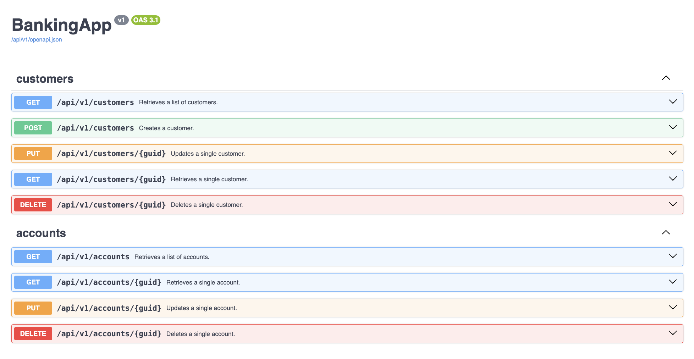

# API Banking Design
This application is for managing customers and accounts within a bank.The REST API interface was built using the FastAPI framework, utilising an SQLite database.

**Tests:** The application has been tested using the pytest library. Currently, these are only unit and integration tests, but these cover the repository layer, the service layer and the various controllers.


## Features implemented
1. Able to create customer and account records.
2. Able to (partially) update individual customer and account records.
3. Able to view account with linked customers.
4. Able to view customer with linked accounts.


## Improvements
1. Pagination for Customer and Accounts APIs.
2. Add Transactions API.
3. E2E tests
4. Add rate limiting.
5. Add example requests to documentation.
6. Add ability to update how statements are received.
7. Add relevant logs for the various layers in the application.

## API Documentation
1. Swagger Documentation is available at http://localhost:8080/docs when the application is run on port 8080.



2. The OpenAPI Document is available at http://localhost:8080/openapi.json when the application is run on port 8080.


## Technologies:
- Python
  - FastAPI
  - Pytest
- SQLite

## Installation

### General

#### Clone repository
```
git clone https://github.com/c-mbdk/api-banking-design.git
```

#### Create .env file
```
cp .env_example .env
```

### REST API

#### Run application
The application will run on port 8080, unless another port is specified.
```
poetry run uvicorn src.main:app --port 8080 --reload
```

#### Run tests
```
poetry run pytest
```
